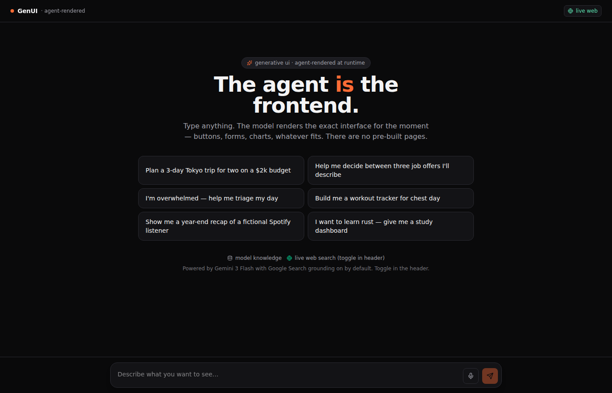
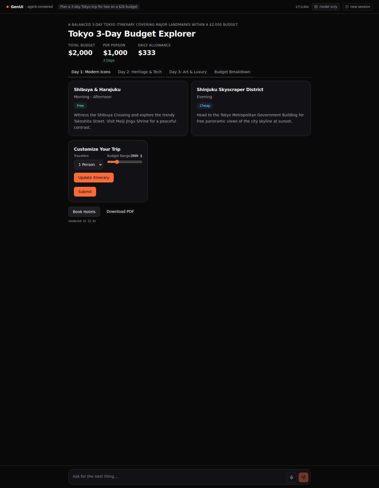

# GenUI · agent-rendered interfaces


A web app where every screen is generated at runtime by **Gemini 3 Flash**.
There are no pre-built pages — you type or speak, the model renders the UI for the moment.

Built for the **Generative UI Global Hackathon** (track: *No Designer, No Problem*).
**Live repo:** https://github.com/bradAGI/genui

## The app



## A single prompt → a full interactive UI

Prompt: *"Plan a 3-day Tokyo trip for two on a $2k budget."* (~10 seconds, ~40 nodes:
heading, 4 stat tiles, 3-tab dayplanner, 6 cards, badges, pie chart, slider,
recalculate-plan form — all generated.)



### Tested demo prompts (all 6 from the hero)

| Prompt | Nodes | Rich/Text | Latency |
|---|---|---|---|
| Plan a 3-day Tokyo trip | 41 | 30 / 7 | 9.5s |
| Decide between three job offers | 37 | 28 / 1 | 17.3s |
| Triage my overwhelming day | 31 | 22 / 2 | 14.7s |
| Workout tracker for chest day | 33 | 23 / 0 | 9.9s |
| Year-end Spotify recap | 27 | 19 / 1 | 9.5s |
| Rust study dashboard | 37 | 28 / 3 | 11.5s |

Avg: **25 rich components** vs **2.3 text nodes** per turn.

## How it works

1. The user types or speaks (Web Speech API mic input) a request, or clicks a button on a previously-rendered screen.
2. `/api/turn` POSTs the message (or `{action, payload}`) to Gemini 3 Flash via the v1beta `generateContent` endpoint, with `responseMimeType: "application/json"` and the strict render-only system prompt.
3. Gemini returns a JSON tree of UI nodes; Zod validates it at the boundary, alias coercion repairs minor field-name drift, and the React renderer paints the tree.
4. The new screen **replaces** the previous one in place — there's no chat scrollback. The UI itself is the conversation.
5. Server-side, the session id keeps the model resumed across turns so it remembers prior context.

The DSL has 24 node types: `stack`, `grid`, `card`, `tabs`, `modal`, `heading`, `text`,
`markdown`, `badge`, `stat`, `progress`, `icon`, `divider`, `image`, `button`, `input`,
`textarea`, `select`, `slider`, `checkbox`, `form`, `chart`, `table`, `html`. The `html`
node is rendered in a sandboxed iframe — the open-generative-UI escape hatch for anything
the DSL can't express.

## Live web grounding (default ON)

The header has a `live web` / `model only` toggle. With grounding on (default), every
turn carries Google's `google_search` tool — the model decides per-turn whether to fire
it. Time-sensitive prompts ("trending papers today", "current weather") get fresh data
plus clickable citation pills under the rendered UI; purely fictional prompts skip the
search and run on training data alone. The header toggle lets users force model-only mode.

## Stack

- **Google DeepMind** — Gemini 3 Flash (`gemini-3-flash-preview`) via Generative Language API v1beta, plus Google Search grounding tool with `groundingMetadata` parsing for citations.
- **Next.js 15** (App Router) + React 19 + Tailwind v4 + Recharts.
- **Zod** for DSL validation; **Web Speech API** for mic input; **shot-scraper + Playwright** for end-to-end testing.
- **A2UI v0.9** (research) — DSL component vocabulary aligned with the spec.
- **AG-UI** (research) — event/payload pattern for the action contract.
- No CopilotKit/LangChain/Postgres/Redis — deliberately lean. One server route + one renderer.

## Run

```bash
git clone https://github.com/bradAGI/genui
cd genui
npm install
echo "GEMINI_API_KEY=your_key_here" > .env.local   # https://aistudio.google.com
npm run dev                                         # http://localhost:3010
# or for prod:
npm run build && npm run start
```

**Smoke tests** (validates the whole pipeline against the live API):

```bash
npm run smoke:gemini             # default model-only run
GEMINI_GROUNDING=true npm run smoke:gemini "trending AI papers today"
```

## Files

- `src/lib/dsl.ts` — Zod DSL (24 node types, single source of truth) + alias coercion
- `src/lib/system-prompt.ts` — render-only system prompt with field-name reference
- `src/lib/extract-json.ts` — robust JSON extractor (fenced blocks, brace-matched)
- `src/lib/llm.ts` — provider abstraction
- `src/lib/providers/gemini.ts` — fetch wrapper around Generative Language v1beta
- `src/app/api/turn/route.ts` — server route (one round-trip per turn)
- `src/components/genui/Renderer.tsx` — recursive React renderer for all 24 nodes
- `src/components/ChatInput.tsx` — text + mic (Web Speech) input
- `src/components/Hero.tsx` — landing-screen demo prompts
- `src/components/ProviderPicker.tsx` — header grounding toggle
- `scripts/smoke-gemini.ts` — end-to-end smoke test against the live API
- `scripts/dump-gemini-grounding.ts` — utility to inspect raw `groundingMetadata`

## Notes

- **Grounding ↔ structured output tradeoff.** Gemini's `responseSchema` is OpenAPI-3 (no `$ref`, no recursion) and is incompatible with the `google_search` tool. We get the best of both by skipping `responseSchema` entirely and relying on a strict system prompt + JSON extraction + Zod validation. Output stays valid; recursion stays intact; grounding works.
- **Session memory** is in-process (a `Map<sessionId, history[]>`). Server restarts wipe it. Fine for a hackathon demo; a real deploy would back this with Redis.
- **Field-name drift.** Gemini occasionally returns `direction` instead of `dir`, `success` instead of `positive` for stat tones, or omits `action` on a button. The alias-coercion preprocessor in `dsl.ts` heals these silently rather than failing the turn.
